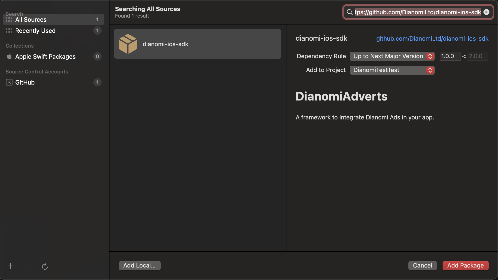
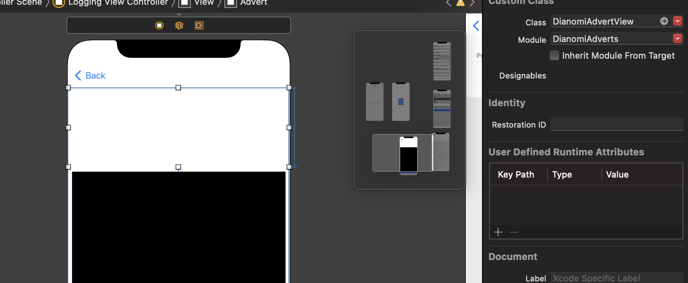

# Dianomi advert SDK compatibility
## Minimum iOS versions supported
The Dianomi SDK supports iOS 11 and above.

## Including the Dianomi SDK in your Xcode project
> The preferred way of integrating the Dianomi Adverts SDK is using Swift Package Manager system (SPM). Depending your existing Xcode project set-up you might want to use a different integration method. The following instructions assume standard integration via SPM system.

### Add URL of Dianomi repository to your Xcode project

In the Xcode go to Project -> Package Dependencies. Now click the add button ( + ) and enter the GitHub project URL into the field and continue using Add Package button.



### Import DianomiAdverts module

Now import the module from your source file

```
import DianomiAdverts
```
Now the Dianomi Adverts SDK should be integrated and ready to use.

## Loading and displaying adverts
### Creating a container

A `DianomiAdvertView` container can be defined in the interface builder or can be created programmatically.

> Regardless of how the container is created, you must provide the container with a context feed ID

> Optionally, you may also provide an Advert Context

### Interface Builder layout example
To define a container, use the standard `UIKitView` element and override its Class to `DianomiAdvertView` and Module `DianomiAdverts`. You'll also need to define the following properties:

- `ContextFeedId` (required)
- `AdvertContext` (optional)




### Programmatic example
To create the same `DianomiAdvertView` programmatically, instantiate it like you would any other UIKit View, configure it and add it to its parent, e.g.

```
let advert = DianomiAdvertView(contextFeedID: "123")
view.addSubView(advert)
```

In most cases, you’ll also need to specify the advert’s container size and position using standard UIKit methods (autolayout constraints, View’s frame or any other method). The dimensions (especially Advert’s height) configured at this time might not be the final one.

### Loading content

To load content for a container, call `loadAd()`.

```
advert.loadAd()
```

### Disposing

You should dispose a container when it is no longer required by removing it from View hieararchy.

Optionally you might also call a container stop() method to stop any pending loading activity.

```
advert.stop()
```

### Container sizing
Dianomi web content is designed to adapt its height based on the available width. Therefore, when adding a container to a layout

- Provide the container with a defined width
- Provide the container with an initial height based on the **likely** height of the final content to be rendered for that container.
- Expect the container to potentially grow beyond that initial height depending on the actual content shown, as well as factors such as width and device accessibility settings

**Actual** height will vary. For example if device accessibility settings increase font sizes then text within advert content will be larger, potentially causing the container to be taller than if font sizes were the default..

Once the content is loaded and rendered the SDK will calculate the actual optimum height to display and set the DianomiAdvertView'scontentHeight property. The app might want to adjust the frame size and update the initial height to a new size.


> The `contentHeight` property is initialised to initial frame height. It will only contain the optimal value once the content is fully loaded and rendered (e.g.: when `status == .rendered`) to the initial frame. It is suggested to listed to a status change call back and adjust dimensions when.

> In order to minimise the change in height from initial minimum to final height once content has loaded, it may be appropriate to provide different initial Minimum Heights for different screen configurations (e.g. landscape vs portrait) and/or for different scree sizes (e.g. smallest width 600 vs smaller).

> For the smooth transition and the best user experience it is recommended to animate the change of the container height size. Such as by using `UIView.animate(withDuration:animations:)` or similar.

### Handling Ad interactions

When the user taps on an individually tappable advert within a container, the SDK will open an external browser for the target URL.
Other web content within a container may also be clickable, e.g. the Dianomi logo that opens the Dianomi website in an external browser.
